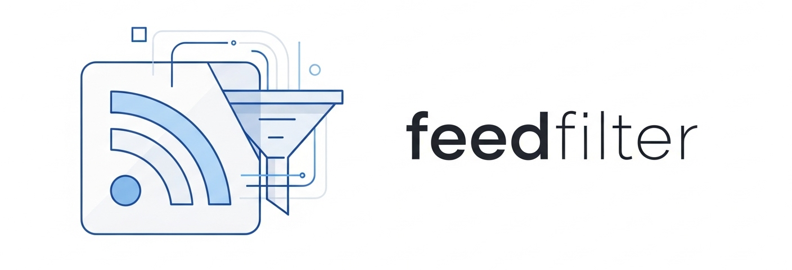

**feedfilter* is a versatile RSS feed filtering and manipulation tool.

## Features

- **Filter by keyword**: Include or exclude feed items based on keywords in the title or description.
- **Filter by author**: Include or exclude feed items based on author.
- **And more!**: More features to come.

## Usage

```bash
feedfilter [options] <feed-url>
```

### Options

- `-i, --include-keyword <keyword>`: Include items with this keyword.
- `-e, --exclude-keyword <keyword>`: Exclude items with this keyword.
- `-a, --include-author <author>`: Include items from this author.
- `-x, --exclude-author <author>`: Exclude items from this author.
- `-o, --output <file>`: Output to file instead of stdout.

## Installation

### macOS via Homebrew

```shell
brew install cdzombak/oss/feedfilter
```

### Debian via apt repository

[Install my Debian repository](https://www.dzombak.com/blog/2025/06/updated-instructions-for-installing-my-debian-package-repositories/) if you haven't already:

```shell
sudo mkdir -p /etc/apt/keyrings
curl -fsSL https://dist.cdzombak.net/keys/dist-cdzombak-net.gpg -o /etc/apt/keyrings/dist-cdzombak-net.gpg
sudo chmod 644 /etc/apt/keyrings/dist-cdzombak-net.gpg
sudo mkdir -p /etc/apt/sources.list.d
sudo curl -fsSL https://dist.cdzombak.net/cdzombak-oss.sources -o /etc/apt/sources.list.d/cdzombak-oss.sources
sudo chmod 644 /etc/apt/sources.list.d/cdzombak-oss.sources
sudo apt update
```

Then install `feedfilter` via `apt-get`:

```shell
sudo apt-get install feedfilter
```

### Manual installation from build artifacts

Pre-built binaries for Linux and macOS on various architectures are downloadable from each [GitHub Release](https://github.com/cdzombak/feedfilter/releases). Debian packages for each release are available as well.

### Build and install locally

```shell
git clone https://github.com/cdzombak/feedfilter.git
cd feedfilter
make build
cp out/feedfilter $INSTALL_DIR
```

## Docker images

Docker images are available for a variety of Linux architectures from [Docker Hub](https://hub.docker.com/r/cdzombak/feedfilter) and [GHCR](https://github.com/cdzombak/feedfilter/pkgs/container/feedfilter). Images are based on the `scratch` image and are as small as possible.

Run them via, for example:

```shell
docker run --rm cdzombak/feedfilter:1 [OPTIONS]
docker run --rm ghcr.io/cdzombak/feedfilter:1 [OPTIONS]
```

## License

GNU General Public License v3.0; see [LICENSE](LICENSE) in this repository.

## Author

This project is maintained by Chris Dzombak ([dzombak.com](https://www.dzombak.com) / [github.com/cdzombak](https://www.github.com/cdzombak)).
